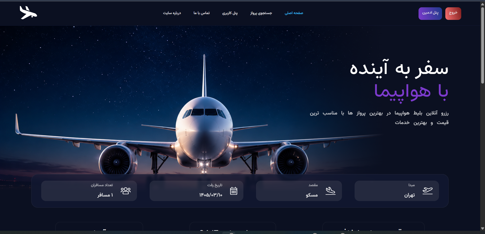
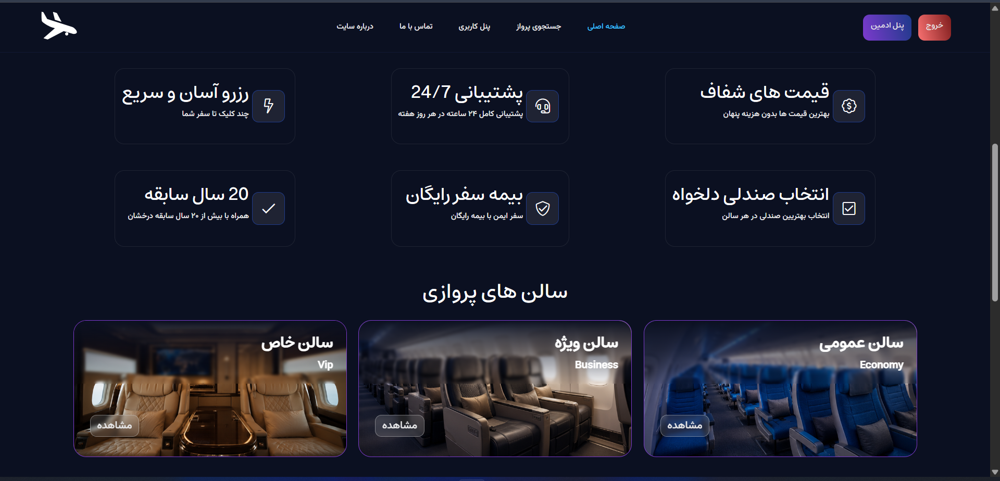
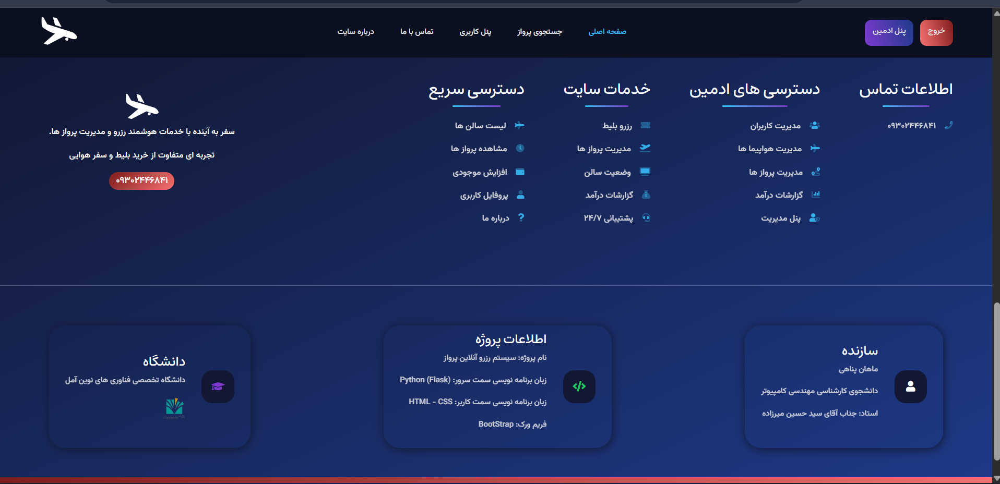
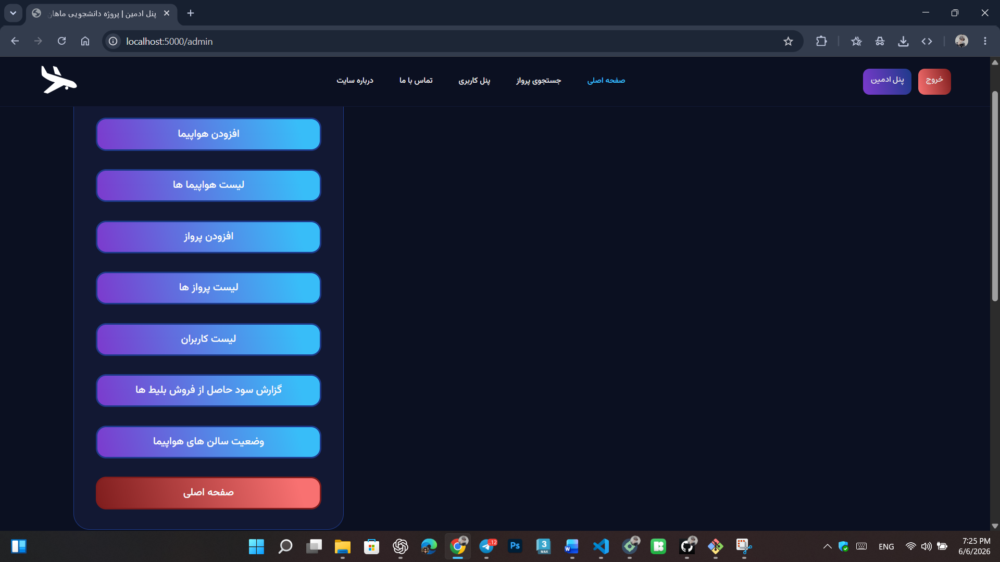
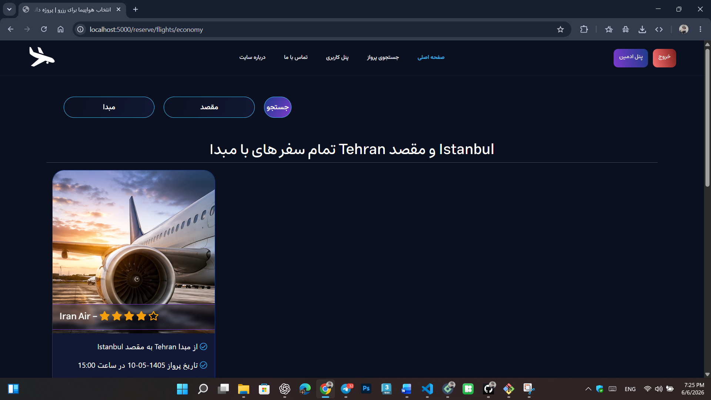
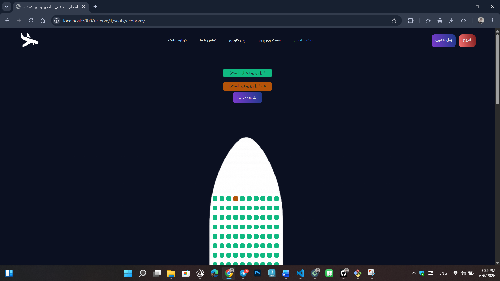

# Airline Reservation System

## Developer
Mahan Panahi

## University
Amol University of Modern Technologies

## Instructor
Seyed Hossein Mirzadeh

## Technologies

- Python
- Flask
- Bootstrap
- HTML5
- CSS3
- JavaScript
- Flexbox
- CSS Grid

## Features

### User Features

- User Registration
- Login System
- Profile Management
- Wallet Charging
- Flight Reservation
- Flight Search
- Economy, Business and VIP Classes

### Admin Features

- User Management
- Aircraft Management
- Flight Management
- Revenue Reports
- Live Aircraft Hall Monitoring

## Project Type

Advanced Programming Course Project

## Preview

